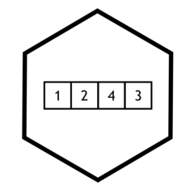

# badsoRts 

<!-- badges: start -->
<!-- badges: end -->

The goal of badsoRts is to ...

## Installation

You can install the released version of badsoRts from [CRAN](https://CRAN.R-project.org) with:

``` r
install.packages("badsoRts")
```

## Example

This is a basic example which shows you how to solve a common problem:

``` r
library(badsoRts)
## basic example code
```

